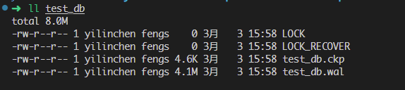
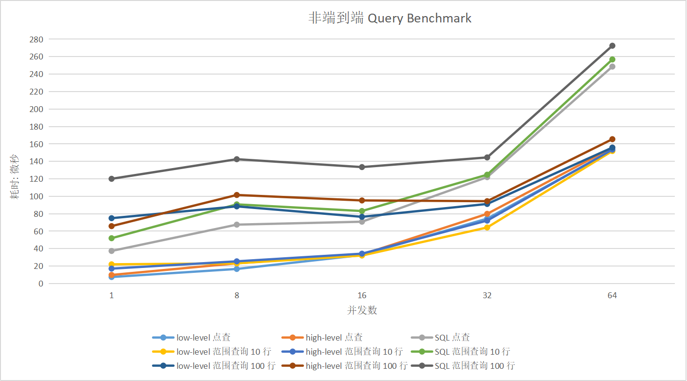
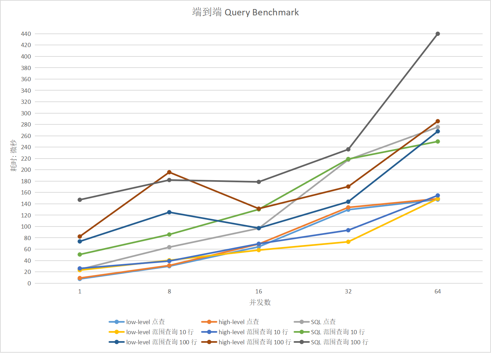
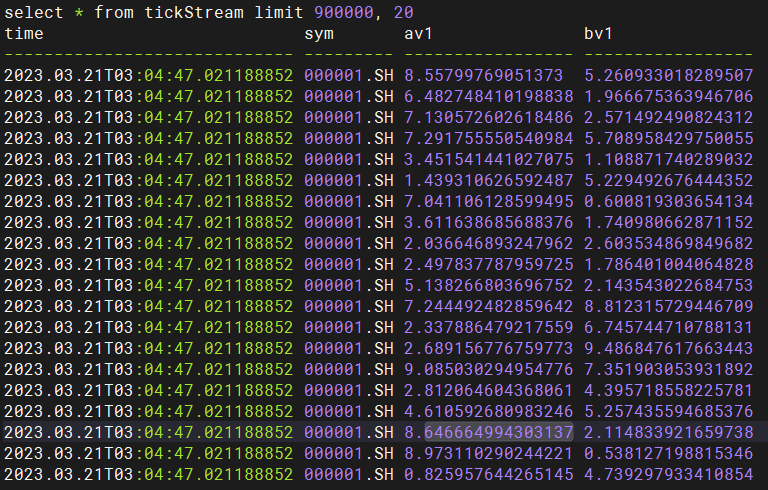
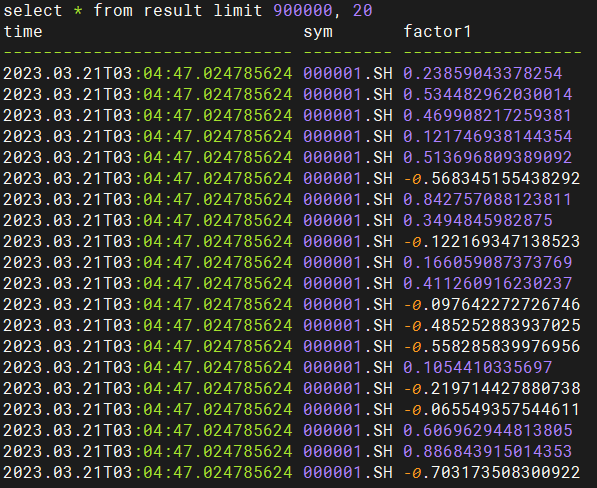

# Swordfish 参考手册

**版权声明**

*© DolphinDB, Inc。2023。浙江智臾科技有限公司保留所有权利。**未经版权所有者**事先**书面许可**，**本文**档中受版权保护的**任何部分不得以任何形式**或通过**任何**手段（图片、电子或机械方式，包括影印、录像或存储在电子检索系统中）**进行复制**。*

**免责声明**

由于产品设计和实现的不断迭代，本文件的内容可能会被修改，恕不另行通知。DolphinDB, Inc. 对因使用本文件而造成的任何错误或损失不承担任何责任。

**适用受众与环境**

*受众*

Swordfish 是 **DolphinDB, Inc.** 开发的一款嵌入式版本数据库产品。目前提供以下主要功能：

- 交易型内存数据库
- DolphinDB 函数库
- DolphinDB 脚本语言
- DolphinDB 批计算引擎和流计算引擎

Swordfish 仅面向付费的商业用户，不提供社区版。商业用户如需测试或试用，请电邮联系 sales@dolphindb.com 或已知的 DolphinDB 销售人员。

通过阅读本手册，能够达成以下目标：

- 了解 Swordfish 的基本概念。
- 了解常用使用场景。
- 了解类的基本语法和使用方法。
- 了解版本许可证（license）对于产品使用的影响。
- 掌握流计算引擎在该产品中的基本使用方法。
- 掌握调用函数的方法。
- 掌握面向场景的脚本编写基本方法。

*环境*

本手册描述的产品适用于以下硬件环境和软件环境。

- **硬件配置**：104 Intel(R) Xeon(R) Gold 5320 CPU @ 2.20GHz
- **操作系统**：CentOS Linux release 7.9.2009 (Core)

**目录**

- [系统概述](#系统概述)
  - [背景](#背景)
  - [架构](#架构)
  - [特性](#特性)
  - [Swordfish 与 DolphinDB](#swordfish-与-dolphindb)
  - [流计算引擎](#流计算引擎)
  - [License 有效性检查](#license-有效性检查)
- [使用方法](#使用方法)
  - [运行时环境的启停](#运行时环境的启停)
  - [打开/创建数据库](#打开创建数据库)
  - [连接数据库](#连接数据库)
  - [DDL 操作](#ddl-操作)
  - [DML 操作](#dml-操作)
  - [事务处理](#事务处理)
  - [脚本执行](#脚本执行)
- [功能与函数](#功能与函数)
  - [数据库文件](#数据库文件)
  - [索引](#索引)
  - [事务](#事务)
  - [异常](#异常)
  - [Low-level DML 接口](#low-level-dml-接口)
- [脚本样例](#脚本样例)
  - [通过运行 DolphinDB 脚本创建流数据引擎](#通过运行-dolphindb-脚本创建流数据引擎)
  - [流引擎直接输出到内存 OLTP 表](#流引擎直接输出到内存-oltp-表)
  - [内存 OLTP 表订阅接收引擎输出的流表](#内存-oltp-表订阅接收引擎输出的流表)
  - [调用自定义函数和内置函数](#调用自定义函数和内置函数)
  - [智能指针（Smart Pointer）](#智能指针smart-pointer)
  - [数据写入、插入、查询、更新与删除](#数据写入插入查询更新与删除)
- [操作与维护](#操作与维护)
  - [错误管理](#错误管理)
  - [配置管理](#配置管理)
  - [性能测试](#性能测试)
    - [主键索引查询测试](#主键索引查询测试)
    - [向空表插入数据测试](#向空表插入数据测试)
    - [流数据实时计算测试](#流数据实时计算测试)
  - [数据类型支持](#数据类型支持)
- [接口说明](#接口说明)
- [参考](#参考)

## 系统概述

### 背景

在一些金融行业的应用场景中，例如交易系统，其主要工作负载来源于对关系表的高频度、高并发的更新和查询操作。这样的应用场景要求数据的读写和计算能够具有低延迟、高并发的特征，同时保证极高的数据一致性，并提供 ACID 事务的支持。传统的存储引擎由于其架构的设计出发点是将数据存储在磁盘上，在面对上述场景要求时，软硬件层面面临巨大挑战，无法很好地满足上述苛刻的性能要求。

### 架构

为满足上述金融行业中的场景化需求，**DolphinDB,Inc.** 推出了以内存为数据存储环境，以 DolphinDB 内置函数和支持的自定义函数为功能实现途径，以 C++ 语言编写的运行脚本为数据库操作方式的 Swordfish 链接库式数据库（以下简称 Swordfish）。

### 特性

Swordfish 将所有数据都存储在内存中, 省去磁盘 I/O 的开销; 以行存的形式来组织数据, 主要适用于 OLTP 的场景, 支持创建 B+ 树索引 (主键索引和二级索引) 来应对高频度、高并发的更新和查询操作。

Swordfish 支持事务, 默认为 snapshot 隔离级别。它同时提供 Write-Ahead-Logging 和 checkpoint 机制以保证数据的持久化。为了加速重启时的恢复过程, Swordfish 应用了并行恢复机制。

### Swordfish 与 DolphinDB

传统的数据库是 Server/Client 模式, 即使是在同一个进程, 数据也需要通过网络传输。为了省去网络传输的开销, Swordfish 采用了类似于 SQLite 的嵌入式模式, 对外提供一个共享链接库, 用户可以直接用 C++ 代码来操作数据库。

### 流计算引擎

使用 DolphinDB 处理历史数据时，可以通过 SQL 语句配合内置计算函数进行查询和计算（全量或增量）。但在实时数据流计算场景下，计算要求高效和即时，全量查询和计算则无法满足该场景的需求。因此， DolphinDB 精心研发了适合流计算场景的引擎，系统内部采用了增量计算，优化了实时计算的性能。

实际应用中，流数据引擎的计算结果可以输出到共享内存表、流数据表、消息中间件、数据库、API 等终端，以做进一步处理。计算复杂表达式时，亦可将多个流数据引擎通过级联的方式合并成一个复杂的数据流拓扑。

Swordfish 完全支持 DolphinDB 提供的应对不同计算场景的多种引擎，详情参考：[流计算引擎](https://www.dolphindb.cn/cn/help/FunctionsandCommands/SeriesOfFunctions/streamingEngine.html?highlight=%E6%B5%81%E6%95%B0%E6%8D%AE%E5%BC%95%E6%93%8E#id2)。

### License 有效性检查

初始化运行时环境时， 如果 License 中授权的 CPU 核数小于机器实际的 CPU 核数，则 `DolphinDBLib::initializeRuntime` 将会失败，类似以下的信息会记录在log 日志中：

```
The license limits 8 cpu cores, less than the actual cpu cores (12).
```

## 使用方法

### 运行时环境的启停

使用 Swordfish 前, 需要先使用 `DolphinDBLib::initializeRuntime` 初始化 DolphinDB 的运行时环境；在所有操作完成后, 应使用 `DolphinDBLib::finalizeRuntime` 销毁 DolphinDB 的运行时环境。

用法：

```
// 初始化 DolphinDB 运行时环境
DolphinDBLib::initializeRuntime();

// ...

// 所有数据库操作完成后，销毁 DolphinDB 运行时环境 
DolphinDBLib::finalizeRuntime();
```

### 打开/创建数据库

打开 (创建) 数据库:

```
using oltp::DBOption;
using oltp::DB;

// 以默认选项打开或创建数据库
DBOption option;
shared_ptr<DB> db = make_shared<DB>("test_db", option);
```

### 连接数据库

连接一个已打开的数据库:

```
using oltp::Connection;

Connection conn(*db);
```

### DDL 操作

```
// 表包含5列
std::vector<ColumnDesc> colDesc;
colDesc.emplace_back("a", DT_INT, 0);
colDesc.emplace_back("b", DT_INT, 0);
colDesc.emplace_back("c", DT_BOOL, 0);
colDesc.emplace_back("d", DT_LONG, 0);
colDesc.emplace_back("e", DT_STRING, 0);

// 以 "a" 作为主键创建主键索引
std::vector<std::string> pk{"a"};

// 以 "b,c,d" 作为复合键创建 unique 的二级索引
// 以 "d" 作为键创建 non-unique 的二级索引
std::vector<std::pair<bool, std::vector<std::string>>> secondaryKeys{
    {true, {"b", "c", "d"}},
    {false, {"d"}}
};

// 创建表 "table1"
conn.createTable("table1", colDesc, pk, secondaryKeys);

// 删除表 "table1"
conn.dropTable("table1");
```

### DML 操作

```
// 插入
conn.insert(...);

// 查询
conn.query("table1", {}, conn.makeFilters("a>5,a<10"));
conn.execute("select * from table1 where a>5,a<10");
conn.execute("select * from table1 where a>5,a<10 order by a");

// 更新
conn.update("table1", conn.makeColumnUpdateDefs("b=b+1"), conn.makeFilters("a=5"));
conn.execute("update table1 set b=b+1 where a=5");

// 删除
conn.remove("table1", conn.makeFilters("a=5"));
conn.execute("delete from table1 where a=5");

```

### 事务处理

```
// 开始事务
conn.beginTransaction();
// 执行一系列的 DML 操作
conn.insert(...);
conn.update(...);
conn.update(...);
// 提交事务
conn.commit();
// 或者回滚事务: conn.rollback();

// 或者使用 `transaction` 方法, 在一个事务里面执行多条语句, 最后 commit.
conn.transaction([&]() {
    conn.insert(...);
    conn.update(...);
    conn.update(...);
});
```

### 脚本执行

```
ConstantSP obj = conn.execute(R"(
    a = 1；
    b = 2；
    a + b  // 注意，这里不能加分号 `;`, 否则不会返回运算的结果
)");

ConstantSP obj = conn.execute(R"(
    select * from table1 order by a  // 注意，这里不能加分号 `;`, 否则不会返回查询的结果
)");
```

## 功能与函数

### 数据库文件

举例来说，创建了一个名为 *test_db* 的数据库, 其目录组织如下所示：



- *LOCK*: 文件锁
- *LOCK_RECOVER*: 文件锁, 用于只读模式
- *test_db.wal*: Write-Ahead-Log 文件（如果开启了 WAL）
- *teset_db.ckp*: checkpoint 文件（如果开启了 checkpoint）

除此之外，如果数据库运行过程中由于某些原因崩溃了，这个目录下面可能会出现一些临时文件：

- *test_db.wal._in_checkpoint_*
- *test_db.wal._in_recovery_*
- *teset_db.ckp._in_checkpoint_*

这些临时文件在下一次打开数据库时会自动被清理（以只读模式打开数据库也会清理这些文件）。

### 索引

在建表时，必须指定一个主键索引。主键索引是唯一的，无法插入键重复的数据。可以指定多个二级索引。每个索引的键都可以是复合的（多个列的组合）。

创建二级索引可以加速某些查询，但是创建过多的二级索引，可能会严重降低写入/更新的性能。

### 事务

可以使用 `Connection::{beginTransaction,commit,rollback}` 来显式地声明事务的范围，在一个事务范围内，所有的 DML 操作都会一起成功或一起失败。不可以在事务范围内执行 DDL 操作，否则会抛异常。

如果不显式地声明事务的范围，那么每一个 DML 操作都是一个独立的事务。例如，调用 insert 接口插入100条数据，在数据库内部会自动开启一个事务，保证全部数据要么都插入，要么一条都不插入。

### 异常

所有的 DML 操作都可能会抛出两种异常：

- `NeedRetryException`，由于并发事务而导致的读写冲突，不是错误。
- `NotRetryException`，是一种无法处理的错误。例如，写入的表不存在或写入的数据和表的 schema 不匹配时会抛出该异常。

**注意**

> 只有使用 `Connection::beginTransaction` 显式地声明了事务的范围之后，才有可能抛出 `NeedRetryException` 异常。

在显式地声明了事务的范围之后，用户如果捕获到 `NeedRetryException`，需要回滚当前的事务，开启新的事务重新开始执行。如果不显式地声明事务的范围，数据库内部已经自动做了这些操作。

显式开启事务来执行 DML 操作的代码通常如下所示：

```
while (true) {
    try {
        conn.beginTransaction();
        // 执行一系列 DML 操作
        conn.commit();
        break;
    } catch (const NeedRetryException &ex) {
        continue;  // 重试
    } catch (...) {
        conn.rollback();
        throw;
    }
}
```

由于上述代码较为繁琐，所以提供了 `Connection::transaction` 这个与上述代码片段等效的接口，用法如下：

```
conn.transaction([&]() {
    // 执行一系列 DML 操作
});
```

### Low-level DML 接口

`Connection` 类中分别提供了一个 low-level 查询接口和写入接口用于查询和写入数据。使用这些接口时，用户需要提前分配好内存，然后把它传入这个接口，使用方法参考：[数据写入插入查询更新与删除](#数据写入插入查询更新与删除)。

**注意**

> 对于 low-level 查询接口，数据库内部不会检查传入的内存大小是否是足够的；对于 low-level 写入接口，数据库内部不会检查传入的数据是否和表的 schema 匹配。用户必须保证这些要求，否则可能会出现段错误。

low-level 查询接口相比于 high-level 接口，性能大约有 20% 的提升。而 low-level 写入接口相比于 high-level 接口性能几乎没有提升（忽略了构造数据的时间，只统计接口的实际执行时间）。

## 脚本样例

在 Swordfish 中实现具体功能的脚本编写基本逻辑如下：

- 初始化运行时环境：`DolphinDBLib::initializeRuntime()`
- 连接到数据库：`Connection conn(*db)`
- 数据库操作
- 清理环境
- 关闭运行时：`DolphinDBLib::finalizeRuntime()`

面向以下场景例子的脚本编译方法及要求见：[README.demo](README.demo.md)。

### 通过运行 DolphinDB 脚本创建流数据引擎

在以下场景例子中，初始化运行时环境并连接到数据库后，以先后次序实现了以下功能：

1. 定义算子
2. 创建流数据引擎、流数据表、输出表
3. 订阅流数据表
4. 定义生产数据的方法
5. 执行对 200 行数据的计算
6. 清理环境
7. 关闭运行时以释放内存

C++ 例子如下：

```cpp
int main() {

    DolphinDBLib::initializeRuntime(); // 初始化运行时环境
    oltp::DBOption option;
    shared_ptr<DB> db = make_shared<DB>("test_db", option);
    Connection conn(*db); // 连接数据库
  
    std::cout << "Initialize calculation" << std::endl;
  
    conn.execute(R"(
        // 算子
        def sum_diff(x, y){
            return (x-y)/(x+y)
        }

        @state
        def factor1(price) {
            a = ema(price, 20)
            b = ema(price, 40)
            c = 1000 * sum_diff(a, b)
            return  ema(c, 10) - ema(c, 20)
        }

        // 创建引擎、订阅流表
        share streamTable(1:0, `time`sym`price, [TIMESTAMP,STRING,DOUBLE]) as tickStream
        result = table(1000:0, `sym`time`factor1, [STRING,TIMESTAMP,DOUBLE])
        rse = createReactiveStateEngine(name="reactiveDemo", metrics=[<time>,<factor1(price)>], dummyTable=tickStream, outputTable=result, keyColumn="sym")
        subscribeTable(tableName=`tickStream, actionName="factors", handler=tableInsert{rse})

        def produceData(n, mutable tickStream) {
            tickStream.append!(table((now() + (1..n)) as time, take("000001.SH", n) as sym, rand(10.0, n) as price))
        }
    )");
  
    std::cout << "Start calculation" << std::endl;
  
    int ROW_NUM_LIMIT = 200;
    int chunk_size = 20;
    int start = 0;
    while(start < ROW_NUM_LIMIT) {
        conn.execute("produceData(" + std::to_string(chunk_size) + ", tickStream)");
        sleep(1);
        std::string delta_result_query = "select * from result limit "+ std::to_string(start) + ", " + std::to_string(chunk_size);
        auto delta_result = conn.execute(delta_result_query);
        std::cout << delta_result_query << std::endl;
        std::cout << delta_result->getString() << std::endl;
        start += chunk_size;
    }
  
    std::cout << "Clean environment" << std::endl;
  
    conn.execute(R"(
        // 清理环境
        unsubscribeTable(tableName=`tickStream, actionName="factors")
        dropStreamEngine("reactiveDemo")
        undef(`tickStream, SHARED)
        undef(`result`rse)
    )");
  
    DolphinDBLib::finalizeRuntime();
}
```

- 完整代码见：[streamEngineRunDemo](demo/streamEngineRunDemo/main.cpp)
- CMakeLists 见：[streamEngineRun_CMakeLists](demo/streamEngineRunDemo/CMakeLists.txt)
- 编译方法见：[README.demo](README.demo.md)

### 流引擎直接输出到内存 OLTP 表

下面的例子展示了如何实现流引擎直接输出到内存 OLTP 表。定义流计算算子、创建流引擎、向流引擎推送数据等操作被封装为 .dos 脚本中的用户自定义函数，初始化运行时并连接到数据库后，依次进行了如下操作：

1. 加载并运行 .dos 脚本
2. 创建内存 OLTP 表
3. 调用 .dos 脚本中定义的函数创建流引擎，引擎的输出接口为内存 OLTP 表
4. 分批次向流引擎推送数据，并每次查询内存 OLTP 表中是否成功写入了增量计算结果
5. 清理环境（释放流引擎、释放内存 OLTP 表）
6. 关闭运行时

C++ 代码如下：

```cpp
int main() {
    DolphinDBLib::initializeRuntime();
    oltp::DBOption option;
    shared_ptr<DB> db = make_shared<DB>("test_db", option);
    Connection conn(*db);
    auto session = conn.getCurrentSession();
  
    // 在本地路径运行 .dos 文件
    bool success = session->run("../src/streamEngineDemo/streamEngineTest.dos");
    if(!success) {
        throw RuntimeException(session->getLastErrorMessage());
    }
  
    std::cout << "================= create oltp table ================="<< std::endl;
    const string tableName = "result";
    auto tableNameList = conn.listAllTable();
    if(std::count(tableNameList.begin(), tableNameList.end(), tableName) != 0) {
        conn.dropTable(tableName);
    }
    std::vector<ColumnDesc> colDesc;
    colDesc.emplace_back("sym", DT_STRING, 1);
    colDesc.emplace_back("time", DT_TIMESTAMP, 2);
    colDesc.emplace_back("factor1", DT_DOUBLE, 3);
    std::vector<std::string> primaryKey { "time", "sym" };
    std::vector<std::pair<bool, std::vector<std::string>>> secondaryKeys;
    conn.createTable(tableName, colDesc, primaryKey, secondaryKeys);
    auto resultTable = conn.execute("select * from objByName(`"+tableName +")");
    std::cout << resultTable->getString() << std::endl;
  
    // 通过调用 .dos 文件中定义的函数创建流数据引擎 
    conn.execute("createEngine(`"+ tableName +")");
  
    std::cout << "================= intput to stream engine ================="<< std::endl;
    int BLK_SIZE = 20;
    int WT_LIMIT = 200;
    for(int start = 0; start < WT_LIMIT; start += BLK_SIZE) {
        std::string code = "produceData("+ std::to_string(BLK_SIZE) +")";
        conn.execute(code);
        std::cout << code << std::endl;
    
        code = "exec count(*) from objByName(`"+tableName +")";
        auto tableSize = conn.execute(code);
        std::cout << code << std::endl;
        std::cout << tableSize->getString() << std::endl;
    
        code = "select * from objByName(`"+tableName +") order by time limit " + std::to_string(start) + ", " + std::to_string(BLK_SIZE);
        resultTable = conn.execute(code);
        std::cout << code << std::endl;
        std::cout << resultTable->getString() << std::endl;
    
        sleep(1);
    }
  
    std::cout << "================= clean environment ================="<< std::endl;
    conn.execute("cleanEnvironment()");
    conn.dropTable(tableName);
  
    DolphinDBLib::finalizeRuntime();
  
    return 0;
}
```

以上代码中需要注意的是：

1. 内存 OLTP 表不会保持数据的插入顺序，所以以上代码的查询增量计算结果时，对内存 OLTP 表根据时间戳进行了排序。

   ```
   code = "select * from objByName(`"+tableName +") order by time limit " + std::to_string(start) + ", " + std::to_string(BLK_SIZE);
   ```
2. 目前的嵌入式版本还不支持在 `conn.execute()` 函数中使用 Dolphindb SQL 语句直接对内存OLTP表对象进行操作。需要写成 ``objByName(`OLTPtableName)``的形式，用表名通过 `objByName()`函数获取可操作的表对象。

DolphinDB 脚本（.dos）如下：

```
// 算子
def sum_diff(x, y){
    return (x-y)/(x+y)
}

@state
def factor1(price) {
    a = ema(price, 20)
    b = ema(price, 40)
    c = 1000 * sum_diff(a, b)
    return  ema(c, 10) - ema(c, 20)
}

// 创建引擎
def createEngine(outputTableName, rseName="reactiveDemo") {
    inputSchema = table(1:0, `time`sym`price, [TIMESTAMP,STRING,DOUBLE])
    return createReactiveStateEngine(name=rseName, metrics=[<time>,<factor1(price)>], dummyTable=inputSchema, outputTable=objByName(outputTableName), keyColumn="sym")
}

// 向引擎输入数据
def produceData(n, rseName="reactiveDemo") {
    rse = getStreamEngine(rseName)
    rse.tableInsert(table((now() + (1..n)) as time, take("000001.SH", n) as sym, rand(10.0, n) as price))
}

// 清理环境 （释放流数据引擎）
def cleanEnvironment(rseName="reactiveDemo") {
    dropStreamEngine(rseName)
}
```

- 完整代码见：[streamEngineDemo](demo/streamEngineDemo/main.cpp)
- CMakeLists 见：[streamEngineDemo_CMakeLists](demo/streamEngineDemo/CMakeLists.txt)
- 编译方法见：[README.demo](README.demo.md)
- .dos 脚本见：[streamEngineDemo_dos](demo/streamEngineDemo/streamEngineTest.dos)

### 内存 OLTP 表订阅接收引擎输出的流表

下面的例子展示了内存 OLTP 表通过订阅流表来接收流引擎输出的使用场景。定义流计算算子、创建流引擎、向流引擎推送数据等操作被封装为 .dos 脚本中的用户自定义函数，初始化运行时并连接到数据库后，依次进行了如下操作：

1. 加载并运行 .dos 脚本
2. 创建内存 OLTP 表
3. 调用 .dos 脚本中定义的函数创建流数据表
4. 调用 .dos 脚本中定义的函数创建流引擎，引擎的输出接口为流数据表
5. 调用 .dos 脚本中定义的函数建立流表到内存 OLTP 表的订阅
6. 分批次向流引擎推送数据，并每次查询内存 OLTP 表中是否成功写入了增量计算结果
7. 清理环境（取消流表订阅、释放流表、释放流引擎、释放内存 OLTP 表）
8. 关闭运行时

C++ 代码如下：

```cpp
int main() {
    DolphinDBLib::initializeRuntime();
    oltp::DBOption option;
    shared_ptr<DB> db = make_shared<DB>("test_db", option);
    Connection conn(*db);
    auto session = conn.getCurrentSession();
  
    // 在本地路径运行 .dos 文件
    bool success = session->run("../src/streamSubDemo/subscribeTest.dos");
    if(!success) {
        throw RuntimeException(session->getLastErrorMessage());
    }
  
    std::cout << "================= create oltp table ================="<< std::endl;
    const string tableName = "result";
    auto tableNameList = conn.listAllTable();
    if(std::count(tableNameList.begin(), tableNameList.end(), tableName) != 0) {
        conn.dropTable(tableName);
    }
    std::vector<ColumnDesc> colDesc;
    colDesc.emplace_back("sym", DT_STRING, 1);
    colDesc.emplace_back("time", DT_TIMESTAMP, 2);
    colDesc.emplace_back("factor1", DT_DOUBLE, 3);
    std::vector<std::string> primaryKey { "time", "sym" };
    std::vector<std::pair<bool, std::vector<std::string>>> secondaryKeys;
    conn.createTable(tableName, colDesc, primaryKey, secondaryKeys);
    auto resultTable = conn.execute("select * from objByName(`"+tableName +")");
    std::cout << resultTable->getString() << std::endl;
  
    // 通过调用 .dos 文件中定义的函数创建流数据表
    conn.execute("createStreamTable()");
  
    // 通过调用 .dos 文件中定义的函数创建流数据引擎
    conn.execute("createEngine()");
  
    // 通过调用 .dos 文件中定义的函数在内存 OLTP 表中订阅流数据表
    conn.execute("subscribeStreamTable(`"+tableName +")");
  
    std::cout << "================= intput to stream engine ================="<< std::endl;
    int BLK_SIZE = 20;
    int WT_LIMIT = 200;
    for(int start = 0; start < WT_LIMIT; start += BLK_SIZE) {
        std::string code = "produceData("+ std::to_string(BLK_SIZE) +")";
        conn.execute(code);
        std::cout << code << std::endl;
    
        code = "exec count(*) from outStream";
        auto tableSize = conn.execute(code);
        std::cout << code << std::endl;
        std::cout << tableSize->getString() << std::endl;
    
        sleep(1);
    
        code = "exec count(*) from objByName(`"+tableName +")";
        tableSize = conn.execute(code);
        std::cout << code << std::endl;
        std::cout << tableSize->getString() << std::endl;
    
        code = "select * from objByName(`"+tableName +") order by time limit " + std::to_string(start) + ", " + std::to_string(BLK_SIZE);
        resultTable = conn.execute(code);
        std::cout << code << std::endl;
        std::cout << resultTable->getString() << std::endl;
    
        sleep(1);
    }
  
    std::cout << "================= clean environment ================="<< std::endl;
    conn.execute("cleanEnvironment()");
    conn.dropTable(tableName);
  
    DolphinDBLib::finalizeRuntime();
  
    return 0;
}
```

DolphinDB 脚本（.dos）如下：

```
// 算子
def sum_diff(x, y){
    return (x-y)/(x+y)
}

@state
def factor1(price) {
    a = ema(price, 20)
    b = ema(price, 40)
    c = 1000 * sum_diff(a, b)
    return  ema(c, 10) - ema(c, 20)
}

// 创建共享流表
def createStreamTable(streamTableName=`outStream) {
    share(streamTable(1000:0, `sym`time`factor1, [STRING, TIMESTAMP, DOUBLE]), streamTableName)
}

// 创建引擎
def createEngine(rseName="reactiveDemo", streamTableName=`outStream) {
    inputSchema = table(1:0, `time`sym`price, [TIMESTAMP,STRING,DOUBLE])
    return createReactiveStateEngine(name=rseName, metrics=[<time>,<factor1(price)>], dummyTable=inputSchema, outputTable=objByName(streamTableName), keyColumn="sym")
}

// 建立流表订阅
def subscribeStreamTable(outputTableName, streamTableName=`outStream, subActName="streamToOLTP") {
    subscribeTable(tableName=streamTableName, actionName=subActName, handler=tableInsert{objByName(outputTableName)}, msgAsTable=true)
}

// 向引擎输入数据
def produceData(n, rseName="reactiveDemo") {
    rse = getStreamEngine(rseName)
    rse.tableInsert(table((now() + (1..n)) as time, take("000001.SH", n) as sym, rand(10.0, n) as price))
}

// 清理环境 （释放流数据引擎、共享流表和流表订阅）
def cleanEnvironment(streamTableName=`outStream, subActName="streamToOLTP", rseName="reactiveDemo") {
    unsubscribeTable(tableName=streamTableName, actionName=subActName)
    undef(streamTableName,SHARED)
    dropStreamEngine(rseName)
}
```

- 完整代码见：[streamSubDemo](demo/streamSubDemo/main.cpp)
- CMakeLists 见：[streamSubDemo_CMakeLists](demo/streamSubDemo/CMakeLists.txt)
- 编译方法见：[README.demo](README.demo.md)
- .dos 脚本见：[streamSubDemo_dos](demo/streamSubDemo/subscribeTest.dos)

### 调用自定义函数和内置函数

以下的 C++ 代码例子调用了自定义函数和内置函数：

```cpp
int main()
{
    // 初始化运行时环境
    DolphinDBLib::initializeRuntime();

    oltp::DBOption option;
    shared_ptr<DB> db = make_shared<DB>("test_db", option);
    Connection conn(*db); 

    // 调用自定义函数
    conn.execute(R"(
        def sum5(a, b, c, d, f){
            return a + b + c + d + f;
        }
    )");
  
    // 创建一个用于常量result的智能指针并赋值给它
    ConstantSP result = conn.execute("sum5([1,2,3], [10,10,10], 5, 0, 10)");
    std::cout <<result->getString() << std::endl;

    // 调用内置函数
    result = conn.execute("sum3(1 2 3)");
    std::cout <<result->getString() << std::endl;

    // 销毁运行时环境
    DolphinDBLib::finalizeRuntime();
}
```

- 完整代码见：[functionDemo](demo/functionDemo/main.cpp)
- CMakeLists 见：[functionDemo_CMakeLists](demo/functionDemo/CMakeLists.txt)
- 编译方法见：[README.demo](README.demo.md)

### 智能指针（Smart Pointer）

C++ 代码如下：

```cpp
int main()
{
  // 初始化运行时环境
  DolphinDBLib::initializeRuntime();

  // 创建或打开一个数据库
  oltp::DBOption option;
  shared_ptr<DB> db = make_shared<DB>("test_db", option);

  testTable(*db);
  testVector(*db);
  testMatrix(*db);
  testSet(*db);
  testDictionary(*db);

  // 销毁运行时环境
  DolphinDBLib::finalizeRuntime();
  return 0;
}

void testTable(DB &db)
{
  Connection conn(db); //连接数据库

  // 创建表
  std::string colName1 = "id";
  std::string colName2 = "val";
  std::vector<std::string> colNames = {colName1, colName2};
  std::vector<DATA_TYPE> colTypes = {DT_INT, DT_DOUBLE};
  TableSP tb1 = Util::createTable(colNames, colTypes, 0, 0);

  // 插入行
  std::string errMsg;
  ConstantSP id = Util::createConstant(DT_INT);
  ConstantSP val = Util::createConstant(DT_DOUBLE);
  for (auto i = 0; i < 10; ++i)
  {
    id->setInt(i);
    val->setDouble(i * 1.1);
    std::vector<ConstantSP> rowValues = {id, val};
    INDEX rowIdx = i;
    tb1->append(rowValues, rowIdx, errMsg);
  }
  if (errMsg.empty())
  {
    std::cout << tb1->getString() << std::endl;
  }
  else
  {
    std::cout << "insert rows failed! " << errMsg << std::endl;
  }

  // 删除行
  errMsg.clear();
  ConstantSP rowIdx1 = Util::createConstant(DT_INT);
  rowIdx1->setInt(0);
  VectorSP rowIdxVec = Util::createVector(DT_INT, 0, 1);
  rowIdxVec->append(rowIdx1);
  tb1->remove(rowIdxVec, errMsg);
  if (errMsg.empty())
  {
    std::cout << tb1->getString() << std::endl;
  }
  else
  {
    std::cout << "delete row " << rowIdx1->getInt() << " failed! " << errMsg << std::endl;
  }

  // 选取行
  INDEX rowIdx2 = 3;
  ConstantSP row = tb1->getRow(rowIdx2);
  std::cout << "row index: " << rowIdx2;
  std::cout << " id: " << row->getMember(colName1)->getInt();
  std::cout << " val: " << row->getMember(colName2)->getDouble() << std::endl;

  // 更新行
  errMsg.clear();
  id->setInt(111);
  val->setDouble(111.111);
  std::vector<ConstantSP> rowValues = {id, val};
  ConstantSP rowIdx3 = Util::createConstant(DT_INT);
  rowIdx3->setInt(0);
  tb1->update(rowValues, rowIdx3, colNames, errMsg);
  if (errMsg.empty())
  {
    std::cout << tb1->getString() << std::endl;
  }
  else
  {
    std::cout << "update row failed! " << errMsg << std::endl;
  }

  // 从数据库中获取一个表
  TableSP tb2 = conn.execute("table(1 2 3 as id, 11 22 33 as val)");
  std::cout << tb2->getString() << std::endl;

  return;
}

void testVector(DB &db)
{
  Connection conn(db);

  // 创建一个向量对象
  VectorSP v1 = Util::createVector(DT_DOUBLE, 0);

  // 添加元素
  std::vector<double> newData = {1.1, 2.2, 3.3};
  v1->appendDouble(newData.data(), newData.size());

  // 读取元素值
  for (int i = 0; i < v1->size(); ++i)
  {
    std::cout << v1->getDouble(i) << std::endl;
  }

  // 移除元素
  ConstantSP idx = Util::createConstant(DT_INT);
  idx->setInt(0);
  VectorSP idxVec = Util::createVector(DT_INT, 0, 1);
  idxVec->append(idx);
  v1->remove(idxVec);
  std::cout << v1->getString() << std::endl;

  // 从数据库中获取一个向量
  VectorSP v2 = conn.execute("1..10");
  std::cout << v2->getString() << std::endl;

  return;
}

void testMatrix(DB &db)
{
  Connection conn(db);

  // 创建一个矩阵
  int *rawData = new int[12]{1, 2, 3, 4, 5, 6, 7, 8, 9, 10, 11, 12};
  VectorSP m1 = Util::createMatrix(DT_INT, 4, 3, 12, 0, rawData);

  // 设置标签
  VectorSP rowLabelVec = Util::createVector(DT_STRING, 0, 3);
  VectorSP colLabelVec = Util::createVector(DT_STRING, 0, 4);
  std::vector<std::string> rowLabels = {"row1", "row2", "row3"};
  std::vector<std::string> colLabels = {"col1", "col2", "col3", "col4"};
  rowLabelVec->appendString(rowLabels.data(), rowLabels.size());
  colLabelVec->appendString(colLabels.data(), colLabels.size());
  m1->setRowLabel(rowLabelVec);
  m1->setColumnLabel(colLabelVec);
  std::cout << m1->getString() << std::endl;

  // 读取元素值
  for (int i = 0; i < m1->columns(); ++i)
  {
    auto row = m1->getColumn(i);
    for (int j = 0; j < row->size(); ++j)
    {
      std::cout << row->getInt(j) << std::endl;
    }
  }

  // 从数据库中获取一个矩阵
  VectorSP m2 = conn.execute("1..6$2:3");
  std::cout << m2->getString() << std::endl;

  return;
}

void testSet(DB &db)
{
  Connection conn(db);

  // 创建一个集合
  SetSP s1 = Util::createSet(DT_INT, nullptr, 3);

  // 添加一个元素
  ConstantSP val = Util::createConstant(DT_INT);
  val->setInt(1);
  s1->append(val);
  val->setInt(2);
  s1->append(val);
  std::cout << s1->getString() << std::endl;

  // 检查集合是否包含元素
  ConstantSP res = Util::createConstant(DT_BOOL);
  s1->contain(val, res);
  if (res->getBool())
  {
    std::cout << "s1 contains " << val->getInt() << std::endl;
  }

  // 移除元素
  s1->remove(val);
  s1->contain(val, res);
  if (!res->getBool())
  {
    std::cout << "s1 does not contain " << val->getInt() << std::endl;
  }

  // 清理集合
  s1->clear();

  // 从数据库获取一个集合
  SetSP s2 = conn.execute("set(1 3 4 5 5 6 6 7)");
  std::cout << s2->getString() << std::endl;

  return;
}

void testDictionary(DB &db)
{
  Connection conn(db);

  // 创建一个字典
  DictionarySP d1 = Util::createDictionary(DT_INT, nullptr, DT_DOUBLE, nullptr);

  // 添加新的键值对
  ConstantSP k = Util::createConstant(DT_INT);
  k->setInt(1);
  ConstantSP v = Util::createConstant(DT_DOUBLE);
  v->setDouble(1.1);
  d1->set(k, v);
  k->setInt(2);
  v->setDouble(2.2);
  d1->set(k, v);
  std::cout << d1->getString() << std::endl;

  // 检查是否键已存在
  ConstantSP res = Util::createConstant(DT_BOOL);
  d1->contain(k, res);
  if (res->getBool())
  {
    std::cout << "d1 contains " << k->getDouble() << std::endl;
  }

  // 读取特定键值
  std::cout << "key " << k->getInt() << " 's value is" << d1->getMember(k)->getDouble() << std::endl;

  // 移除键值对
  d1->remove(k);
  d1->contain(k, res);
  if (!res->getBool())
  {
    std::cout << "d1 does not contain " << k->getDouble() << std::endl;
  }

  // 清理字典
  d1->clear();

  // 从数据库获取一个字典
  DictionarySP d2 = conn.execute("dict(1 2 3, 10 20 30)");
  std::cout << d2->getString() << std::endl;

  return;
}
```

- 完整代码见：[objectDemo](demo/objectDemo/main.cpp)
- CMakeLists 见：[objectDemo_CMakelists](demo/objectDemo/CMakeLists.txt)
- 编译方法见：[README.demo](README.demo.md)

### 数据写入、插入、查询、更新与删除

以下例子及行间注释解释了如何通过脚本对 Swordfish 进行数据写入、插入、查询、更新和删除操作。

C++ 代码如下：

```cpp
int main(int argc, char* argv[])
{
    // 初始化运行时环境
    DolphinDBLib::initializeRuntime();

    // 连接数据库
    DBOption option;
    std::shared_ptr<DB> db = std::make_shared<DB>("test_db2", option);
    Connection conn(*db);
    const string tableName = "test_table";

    // 创建表
    std::vector<ColumnDesc> colDesc;
    colDesc.emplace_back("col_int", DT_INT, 1);
    colDesc.emplace_back("col_bool", DT_BOOL, 2);
    colDesc.emplace_back("col_long", DT_LONG, 3);

    std::vector<std::string> primaryKey { "col_int" };
    std::vector<std::pair<bool, std::vector<std::string>>> secondaryKeys;
    conn.createTable(tableName, colDesc, primaryKey, secondaryKeys);

    auto obj = conn.execute("select * from test_table");
    std::cout << "================== create table ==================\n";
    std::cout << obj->getString() << "\n";


    // 低位插入数据
    {
        const int rows = 5;
        const size_t bytes_per_row = computeBytes(colDesc, 100);
        RawTableBufferGenerator gen(rows, bytes_per_row);

        const RawTableBuffer& table = gen.get();
        RawTupleBufferWriter writer;
        writer.reset(table.tuples[0]);
        writer.writeInt(5).writeBool(false).writeLong(200);
        writer.reset(table.tuples[1]);
        writer.writeInt(4).writeBool(true).writeLong(211);
        writer.reset(table.tuples[2]);
        writer.writeInt(3).writeBool(false).writeLong(211);
        writer.reset(table.tuples[3]);
        writer.writeInt(2).writeBool(true).writeLong(213);
        writer.reset(table.tuples[4]);
        writer.writeInt(1).writeBool(false).writeLong(215);

        conn.insert(tableName, table);
        auto obj = conn.execute("select * from test_table");
        std::cout << "============= low level insert data =============\n";
        std::cout << obj->getString() << "\n";
    }


    // 插入数据
    {
        // 初始化数据
        std::vector<int> colIntValue { 17, 37, 67 };
        std::vector<char> colBoolValue { 0, 0, 0 };
        std::vector<long long> colLongValue { 199, 224, 238 };
      
        // 创建向量
        VectorSP colInt = Util::createVector(DT_INT, 0, 3);
        VectorSP colBool = Util::createVector(DT_BOOL, 0, 3);
        VectorSP colLong = Util::createVector(DT_LONG, 0, 3);
      
        // 向向量中添加数据
        colInt->appendInt((int*)(colIntValue.data()), 3);
        colBool->appendBool((char*)(colBoolValue.data()), 3);
        colLong->appendLong((long long*)(colLongValue.data()), 3);
      
        // 创建列名和列向量的vector，创建表
        std::vector<string> colNames { "col_int", "col_bool", "col_long" };
        std::vector<ConstantSP> cols { colInt, colBool, colLong };
        TableSP insertTable = Util::createTable(colNames, cols);
        conn.insert(tableName, insertTable);

        auto obj = conn.execute("select * from test_table");
        std::cout << "================== insert data ==================\n";
        std::cout << obj->getString() << "\n";
    }


    // 低位查询
    {
        string filterTxt = "col_long >= 211, col_bool = false";
        vector<ObjectSP> filter = conn.makeFilters(filterTxt);
        vector<string> queryCols { "col_int", "col_bool", "col_long" };

        const int queryRowsMax = 5;
        const size_t bytes_per_row = computeBytes(colDesc, 100);
      
        // 创建查询结果的缓存
        RawTableBufferGenerator queryGen(queryRowsMax, bytes_per_row);
        const RawTableBuffer& resultBuffer = queryGen.get();

        // 查询并输出结果
        size_t queryRows = conn.query(tableName, queryCols, filter, resultBuffer);
        std::cout << "============= low level query data ==============\n";
        RawTupleBufferReader reader;
        cout << "queried rows count: " << queryRows << "\n";
        std::cout << "col_int col_bool col_long\n";
        std::cout << "------- -------- --------\n";
        for (size_t i = 0; i < queryRows; ++i) {
            reader.reset(resultBuffer.tuples[i]);
            std::cout << reader.readInt() << "\t";
            std::cout << int(reader.readBool()) << "\t";
            std::cout << reader.readLong() << "\n";
        }
        std::cout << std::endl;
    }

    // 查询数据
    {
        string filterTxt = "col_long >= 211, col_bool = false";
        vector<ObjectSP> filter = conn.makeFilters(filterTxt);
        vector<string> queryCols { "col_int", "col_bool", "col_long" };
      
        // 执行查询并输出结果
        TableSP tableResult = conn.query(tableName, queryCols, filter);
        std::cout << "================== query data ===================\n";
        std::cout << tableResult->getString() << "\n";
    }


    // 更新数据
    {
        string filterTxt = "col_long >= 211, col_bool = false";
        string updateDefsTxt = "col_int = col_int*10, col_bool = true";
      
        // 创建过滤器和更新列的定义
        vector<ObjectSP> filter = conn.makeFilters(filterTxt);
        vector<ColumnDefSP> columnUpdateDefs = conn.makeColumnUpdateDefs(updateDefsTxt);
      
        // 执行更新操作并输出结果
        size_t changeRows = conn.update(tableName, columnUpdateDefs, filter);
        auto obj = conn.execute("select * from test_table");
      
        std::cout << "================== update data ==================\n";
        std::cout << "changed rows count: " << changeRows << "\n";
        std::cout << obj->getString() << "\n";
    }

    // 删除数据
    {
        string filterTxt = "col_long >= 213, col_int > 5";
      
        // 创建过滤器
        vector<ObjectSP> filter = conn.makeFilters(filterTxt);
      
        // 执行删除操作并输出结果
        size_t removeRows = conn.remove(tableName, filter);
        auto obj = conn.execute("select * from test_table");
      
        std::cout << "================== delete data ==================\n";
        std::cout << "removed rows count: " << removeRows << "\n";
        std::cout << obj->getString() << "\n";
    }

    // 交易过程，过程中只有其中一个交易结果数据会提交
    {
    	// 定义两个交易函数
    	auto transaction1 = [&conn, &tableName]() {
            if (conn.isInActiveTransactionContext()) {
                return;
            }
            conn.beginTransaction();
            string filterTxt = "col_long <= 500, col_bool = true";
            string updateDefsTxt = "col_long = col_long+1";
            vector<ObjectSP> filter = conn.makeFilters(filterTxt);
            vector<ColumnDefSP> columnUpdateDefs = conn.makeColumnUpdateDefs(updateDefsTxt);

            size_t changeRows;
            do {
                changeRows = conn.update(tableName, columnUpdateDefs, filter);
            } while (changeRows > 0);
            conn.commit();
    	};

    	auto transaction2 = [&conn, &tableName]() {
            if (conn.isInActiveTransactionContext()) {
                return;
            }
            conn.beginTransaction();
            string filterTxt = "col_int < 500, col_bool = true";
            string updateDefsTxt = "col_int = col_int+10";
            vector<ObjectSP> filter = conn.makeFilters(filterTxt);
            vector<ColumnDefSP> columnUpdateDefs = conn.makeColumnUpdateDefs(updateDefsTxt);

            size_t changeRows;
            do {
                changeRows = conn.update(tableName, columnUpdateDefs, filter);
            } while (changeRows > 0);
            conn.commit();
        };

        std::thread t1(transaction1);
        std::thread t2(transaction2);

        t1.join();
        t2.join();

        auto obj = conn.execute("select * from test_table");
        std::cout << "================ use transaction ================\n";
        std::cout << obj->getString() << "\n";
    }

    // 交易回滚
    {
        conn.beginTransaction();
        string filterTxt = "col_long <= 500, col_bool = false";
        string updateDefsTxt = "col_long = col_long+1000";
        vector<ObjectSP> filter = conn.makeFilters(filterTxt);
        vector<ColumnDefSP> columnUpdateDefs = conn.makeColumnUpdateDefs(updateDefsTxt);
        conn.update(tableName, columnUpdateDefs, filter);

        auto obj = conn.execute("select * from test_table");
        std::cout << "================= before rollback =================\n";
        std::cout << obj->getString() << "\n";

        conn.rollback();

        obj = conn.execute("select * from test_table");
        std::cout << "================= after rollback =================\n";
        std::cout << obj->getString() << "\n";
    }

    // 删除已经存在的表
    conn.dropTable(tableName);
    // 销毁运行时环境
    DolphinDBLib::finalizeRuntime();
}
```

- 完整代码见：[crudDemo](demo/crudDemo/main.cpp)
- CMakeLists 见：[crudDemo_CMakelists](demo/crudDemo/CMakeLists.txt)
- 编译方法见：[README.demo](README.demo.md)

### 查看订单簿的实时变化

以下例子展示了一个金融交易场景中的订单簿使用场景，用于查看订单簿的实时变化。其主要操作如下：

1. 创建一个数据库并运行一个本地路径下的.dos文件。
2. 初始化DolphinDBLib运行时
3. 使用DBOption选项创建一个名为"test_db"的数据库
4. 创建一个Connection对象和一个session对象，用于与数据库交互。
5. 在本地路径下运行一个名为"orderbookDemo.dos"的文件，并检查是否成功运行。如果未成功运行，则会抛出一个RuntimeException异常。
6. 代码会执行一个SQL查询，返回一个ConstantSP对象，并将其打印到控制台上。
7. 终止DolphinDBLib运行时。

C++ 代码如下：

```cpp
#include "Swordfish.h"  // 包含头文件Swordfish.h

#include <memory>  // 包含头文件memory

using oltp::Connection;  // 使用命名空间oltp中的Connection
using oltp::DB;  // 使用命名空间oltp中的DB
using std::make_shared;  // 使用std命名空间中的make_shared
using std::shared_ptr;  // 使用std命名空间中的shared_ptr

int main() {  

    DolphinDBLib::initializeRuntime();  // 初始化DolphinDBLib运行时

    oltp::DBOption option;  // 创建一个DBOption对象option
    shared_ptr<DB> db = make_shared<DB>("test_db", option);  // 创建一个名为"test_db"的数据库，并使用make_shared创建一个shared_ptr指针db指向该数据库
    Connection conn(*db);  // 创建一个Connection对象conn，并将指向db的shared_ptr指针解引用作为参数传入conn的构造函数中
    auto session = conn.getCurrentSession();  // 创建一个session对象，并将Connection对象conn的getCurrentSession()方法返回值赋值给session

    bool success = session->run("../../demo/orderbookDemo/orderbookDemo.dos");  // 在本地路径下运行名为"orderbookDemo.dos"的文件，并将结果赋值给success
    if(!success) {  // 如果运行失败
        throw RuntimeException(session->getLastErrorMessage());  // 抛出RuntimeException异常，异常信息为session的getLastErrorMessage()方法返回值
    }

    ConstantSP cnt = conn.execute("exec count(*) from outTable");  // 执行SQL查询语句"exec count(*) from outTable"，并将结果赋值给ConstantSP对象cnt
    std::cout << cnt->getString() << std::endl;  // 将ConstantSP对象cnt转换为字符串并打印到控制台上

    TableSP res = conn.execute("select top 20 * from outTable");  // 执行SQL查询语句"select top 20 * from outTable"，并将结果赋值给TableSP对象res
    std::cout << res->getString() << std::endl;  // 将TableSP对象res转换为字符串并打印到控制台上

    DolphinDBLib::finalizeRuntime();  // 终止DolphinDBLib运行时

    return 0;  // 返回0表示程序执行成功
}
```

DolphinDB 脚本（.dos）如下：

```
/*
 *  功能：批计算合成10支股票全天 1s 频率行情数据
 *  最近一次更新日期：2023.06.06
 */

// 登录
login("admin", "123456")

// 创建引擎参数outputTable，即指定输出表
suffix = string(1..10)
colNames = `SecurityID`timestamp`lastAppSeqNum`tradingPhaseCode`modified`turnover`volume`tradeNum`totalTurnover`totalVolume`totalTradeNum`lastPx`highPx`lowPx`ask`bid`askVol`bidVol`preClosePx`invalid  join ("bids" + suffix) join ("bidVolumes" + suffix) join ("bidOrderNums" + suffix) join ("asks" + suffix)  join ("askVolumes" + suffix) join ("askOrderNums" + suffix) 
colTypes = [SYMBOL,TIMESTAMP,LONG,INT,BOOL,DOUBLE,LONG,INT,DOUBLE,LONG,INT,DOUBLE,DOUBLE,DOUBLE,DOUBLE,DOUBLE,LONG,LONG,DOUBLE,BOOL] join take(DOUBLE, 10) join take(LONG, 10) join take(INT, 10) join take(DOUBLE, 10) join take(LONG, 10) join take(INT, 10) 
outTable = table(10000000:0, colNames, colTypes)

// 创建引擎参数dummyTable，即指定输入表的表结构
colNames = `SecurityID`Date`Time`SecurityIDSource`SecurityType`Index`SourceType`Type`Price`Qty`BSFlag`BuyNo`SellNo`ApplSeqNum`ChannelNo
colTypes = [SYMBOL, DATE, TIME, SYMBOL, SYMBOL, LONG, INT, INT, LONG, LONG, INT, LONG, LONG, LONG, INT]
dummyOrderStream = table(1:0, colNames, colTypes)

// 创建引擎参数inputColMap，即指定输入表各字段的含义
inputColMap = dict(`codeColumn`timeColumn`typeColumn`priceColumn`qtyColumn`buyOrderColumn`sellOrderColumn`sideColumn`msgTypeColumn`seqColumn, `SecurityID`Time`Type`Price`Qty`BuyNo`SellNo`BSFlag`SourceType`ApplSeqNum)

// 创建引擎参数prevClose，即昨日收盘价，prevClose不影响最终的输出结果中除昨日收盘价以外的其他字段
prevClose = dict(`000587.SZ`002694.SZ`002822.SZ`000683.SZ`301063.SZ`300459.SZ`300057.SZ`300593.SZ`301035.SZ`300765.SZ, [1.66, 6.56, 6.10, 8.47, 38.10, 5.34, 9.14, 48.81, 60.04, 16.52])

// 释放已有的引擎
try { dropStreamEngine("demo") } catch(ex) { print(ex) }  
// 定义引擎，每1s计算输出深交所股票10档买卖盘口
engine = createOrderBookSnapshotEngine(name="demo", exchange="XSHE", orderbookDepth=10, intervalInMilli = 1000, date=2022.01.10, startTime=09:15:00.000, prevClose=prevClose, dummyTable=dummyOrderStream, outputTable=outTable, inputColMap=inputColMap)

// 从server目录下的csv文件加载输入数据至内存，输入数据为逐笔成交和逐笔委托数据合成的一张表
filePath = "../../demo/orderbookDemo/orderbookDemoInput.csv"
colNames = `SecurityID`Date`Time`SecurityIDSource`SecurityType`Index`SourceType`Type`Price`Qty`BSFlag`BuyNo`SellNo`ApplSeqNum`ChannelNo
colTypes = [SYMBOL, DATE, TIME, SYMBOL, SYMBOL, LONG, INT, INT, LONG, LONG, INT, LONG, LONG, LONG, INT]
orderTrade = table(1:0, colNames, colTypes)
orderTrade.append!(select * from loadText(filePath) order by Time)

// 10支股票的逐笔数据批量注入快照合成引擎
engine.append!(orderTrade)
```


* 完整代码见：[orderbookDemo](demo/orderbookDemo/main.cpp)
* CMakeLists 见：[orderbookDemo_CMakelists](demo/orderbookDemo/CMakeLists.txt)
* 编译方法见：[README.demo](README.demo.md)
* .dos脚本见：[orderbookDemo.dos](demo/orderbookDemo/orderbookDemo.dos)
* 模拟数据集见：[orderbookDemoInput](demo/orderbookDemo/orderbookDemoInput.csv)


### 基于逐笔成交行情数据实时合成分钟K线

以下例子模拟了在金融交易场景中根据逐笔成交行情数据合成分钟K线图的场景。其主要操作如下：

1. 初始化DolphinDB运行时环境，创建并打开一个名为"test_db"的数据库。
2. 获取当前连接会话的一个Connection对象和session对象，用于之后运行.dos脚本及调用函数。
3. 运行streamFunc.dos脚本，调用脚本中定义的函数，创建流表、内存表；加载数据，并创建时间序列聚合流引擎和流表间的订阅。
4. 定义两个lambda函数（writeData和readData）作为线程函数，在两个子线程上分别向流引擎中写入数据和从结果表中读取数据。
5. 创建两个线程t1和t2，并等待线程结束。
6. 在连接上执行cleanEnv()函数，清理环境，并终止DolphinDB运行时环境。

C++ 代码如下：

```cpp
// 导入Swordfish库
#include "Swordfish.h" 

// 导入C++标准库
#include <iostream>
#include <string>
#include <thread>

using std::shared_ptr;
using std::make_shared;

using oltp::DB;
using oltp::Connection;


int main() {
    // 初始化运行时环境
    DolphinDBLib::initializeRuntime();
  
    // 打开/创建名为test_db的数据库，并获取连接会话对象
    oltp::DBOption option;
    shared_ptr<DB> db = make_shared<DB>("test_db", option);
    Connection conn(*db);
    auto session = conn.getCurrentSession();
  
    const string inputTableName = "trade";
    const string outputTableName= "aggrStream";
    const string resultTableName = "ohlcStream";
  
    // 在当前连接运行streamFunc.dos脚本文件，定义之后会用到的函数
    bool success = session->run("../../demo/ohlcDemo/streamFunc.dos");
    if(!success) {
        throw RuntimeException(session->getLastErrorMessage());
    }
  
    // 在当前连接运行定义好的函数，创建内存表并加载数据，创建流表，创建时序聚合流数据引擎并订阅流表
    conn.execute("loadInputTable(tableName=`"+ inputTableName +")");
    conn.execute("createEngineOutputStream(tableName=`"+ outputTableName +")");
    conn.execute("createResultStream(tableName=`" + resultTableName + ")");
    conn.execute("createTsEngine(outputTableName=`" + outputTableName + ", inputTableName=`" + inputTableName + ")");
    conn.execute("subscribeStreamTable(outputTableName=`"+ resultTableName + ", inputTableName=`" + outputTableName + ")");
  
    std::cout << "Initializing..." << std::endl;
  
    // 向流引擎写数据的线程函数
    auto writeData = [ &inputTableName, &db]() {
        // 在线程上创建新的数据库连接，并运行streamFunc.dos脚本定义函数
        Connection conn1(*db);
        auto session = conn1.getCurrentSession();
        session->run("../../demo/ohlcDemo/streamFunc.dos");
    
        // 每隔一秒从内存表取1000条数据推入流引擎计算K线
        std::string code = "exec count(*) from objByName(`"+ inputTableName +")";
        int inputSize = conn1.execute(code)->getInt();
        int BLK_SIZE = 1000;
        for(int start = 0; start < inputSize; start += BLK_SIZE) {
            std::string cmd = "insertToEngine("+ std::to_string(start) + ", " + std::to_string(BLK_SIZE) +")";
            conn1.execute(cmd);
            sleep(1);
        }
    };
  
    // 读取流引擎输出的线程函数
    auto readData = [ &resultTableName, &db]() {
        // 在线程上创建新的数据库连接
        Connection conn2(*db);
    
        // 每隔两秒，从结果流表中读10条流引擎输出推送过来的数据
        int start = 0;
        int end = 2300;
        int currentLen = 0;
        while(start <= end) {
            currentLen = conn2.execute("exec count(*) from objByName(`"+ resultTableName +", true)")->getInt();
            if(currentLen >= start+10) {
                auto data = conn2.execute("select * from objByName(`"+ resultTableName +", true) limit " + std::to_string(start) + ", 10");
                std::cout << data->getString() << std::endl;
                start += 10;
            } 
            sleep(2);
        }
    };
  
    // 启动读写线程，并等待线程运行结束
    std::thread t1(writeData);
    std::thread t2(readData);
    t1.join();
    t2.join();
  
    // 清理环境，结束运行时环境
    conn.execute("cleanEnv()");
    DolphinDBLib::finalizeRuntime();
  
    return 0;
}
```


* 完整代码见：[ohlcDemo](demo/ohlcDemo/main.cpp)
* CMakeLists 见：[ohlcDemo_CMakelists](demo/ohlcDemo/CMakeLists.txt)
* 编译方法见：[README.demo](README.demo.md)
* .dos脚本见：[streamFunc.dos](demo/ohlcDemo/streamFunc.dos)
* 模拟数据集见：[trade.zip](demo/ohlcDemo/trade.zip)

## 操作与维护

### 错误管理

Swordfish 中可能出现的错误信息及解决方法如下：

| **错误信息**                                                          | **错误原因**                                                                                                                                   | **解决办法**                                                                                                                                                      |
| --------------------------------------------------------------------------- | ---------------------------------------------------------------------------------------------------------------------------------------------------- | ----------------------------------------------------------------------------------------------------------------------------------------------------------------------- |
| “DolphinDB runtime initialization failed, please check the info log file” | `DolphinDBLib::initializeRuntime()` 初始化 DolphinDB 运行时环境失败                                                                                | 检查 log 文件, 比如*dolphindb.log*                                                                                                                                    |
| "DolphinDB runtime has been destroyed"                                      | 已经调用 `DolphinDBLib::finalizeRuntime()` 销毁了 DolphinDB 运行时环境, 无法再次初始化                                                             |                                                                                                                                                                         |
| “Failed to acquire db-file-lock: locked by other“                         | 该数据库已经被其他进程/线程以读写模式打开                                                                                                            |                                                                                                                                                                         |
| “Failed to acquire recover-file-lock, retry later”                        | 发生在以只读模式打开数据库时。由于其他进程/线程也正在打开这个数据库，并且正在进行 recover。等待大约 20 秒后，如果 recover 仍未结束，就会报这个错误。 | 在同一个进程中，尽量不要试图在多个线程里以只读模式打开同一个数据库。                                                                                                    |
| “The feature of publish is not enabled. RefId:S00001”                     | 运行streamEngineRunDemo前发布端没有指定可以连接它进行订阅的节点数量，故不具备发布功能。                                                              | 在编译后可执行文件所在的 `/build/bin`路径下新建一个*dolphindb.cfg*配置文件，在其中添加 `maxPubConnections`配置参数，并为其赋值。例如：`maxPubConnections=64` 。 |

### 配置管理

在打开一个数据库时, 可以通过 DBOption 的以下参数来指定数据库的运行模式:

- `enableWAL=false, enableCheckpoint=false`: 纯内存模式, 数据在重启之后丢失。
- `enableWAL=false, enableCheckpoint=true`: 定期做 checkpoint 将内存里的数据保存到持久化存储上。在两次 checkpoint 之间对数据的修改将会丢失。
- `enableWAL=true, syncOnTxnCommit=false`: 开启 WAL, 对数据进行修改之前, 会先写 log 到持久化存储上。数据在重启之后不会丢失。事务 commit 成功之后, 保证 log 写到了操作系统的缓存里, 但是不保证 log 已经写到了持久化存储上。因此, 如果进程崩溃, 数据不会丢失, 但是当操作系统崩溃(机器掉电), 可能会有数据丢失。
- `enableWAL=true, syncOnTxnCommit=true`: 同上, 但是在事务 commit 成功之后, 保证 log 已经写到了持久化存储上, 即使操作系统崩溃, 数据也不会丢失。(但是如果存储设备故障, 还是可能有数据丢失)。

**使用建议**

- 如果需要持久化数据, 并且对数据的一致性要求较高, 绝对无法忍受数据丢失, 推荐使用 `enableWAL=true`, `syncOnTxnCommit=true`, `enableCheckpoint=true`。这种模式下, 性能较差。
- 如果需要持久化数据, 并且可以容忍操作系统崩溃(机器掉电)时的数据丢失, 推荐使用 `enableWAL=true`, `syncOnTxnCommit=false`, `enableCheckpoint=true`。这种模式下, 性能较好。(默认配置)。
- `DBOption::readOnly` 指示是否以只读模式打开数据库。多个进程可以同时以只读模式打开同一个数据库。如果非必要, 不要在同一进程的多个线程中同时以只读模式打开同一个数据库, 因为每次打开一个数据库, 都会将磁盘文件 (WAL 和 checkpoint 文件, 如有) 里的数据加载到内存里, 消耗大量的内存。因此，推荐的方式是只打开一个数据库一次, 然后在不同的线程里面连接到这个数据库, 并发地读写这个数据库。

### 性能测试

#### 主键索引查询测试

**测试环境**

性能测试中使用的硬件配置和操作系统信息仅供参考：

- 操作系统：CentOS Linux release 7.9.2009 (Core)
- 系统配置：104 Intel(R) Xeon(R) Gold 5320 CPU @ 2.20GHz

测试表的 schema 如下:

| **列名** | **数据类型** | **备注** |
| -------------- | ------------------ | -------------- |
| a              | LONG               | 主键索引       |
| b              | LONG               |                |
| c              | LONG               |                |
| d              | LONG               |                |
| e              | INT                |                |
| f              | INT                |                |
| g              | INT                |                |
| h              | DOUBLE             |                |
| i              | DOUBLE             |                |
| j              | DOUBLE             |                |

在该测试中，表内一共有1,000,000条数据。分别测试了不同条件下点查（query one row）和范围查询（query multi-rows）的时间消耗（单位：μs / 微秒）。

测试条件中，

- **Low Level**、**High Level**、**SQL**： 调用不同类型的查询接口。
- **端到端**：时间消耗是否为全链路范围的，全链路时延包括 low-level 和 high-level 接口的 Filter 构造时间、SQL 接口的构造（编译） SQL 语句时间。如果端到端为 False，则只会统计查询接口函数的实际执行时间。

非端到端测试结果如下：



|                            | 并发数：1 | 并发数：8 | 并发数：16 | 并发数：32 | 并发数：64 |
| -------------------------- | --------- | --------- | ---------- | ---------- | ---------- |
| low-level 点查             | 7.37      | 16.61     | 32.58      | 74.32      | 152.55     |
| high-level 点查            | 9.74      | 23.1      | 33.1       | 79.79      | 155.72     |
| SQL 点查                   | 37.25     | 67.41     | 70.76      | 121.85     | 248.62     |
| low-level 范围查询 10 行   | 21.91     | 23.06     | 32         | 64.15      | 151.81     |
| high-level 范围查询 10 行  | 16.99     | 25.35     | 34.13      | 72.05      | 153.43     |
| SQL 范围查询 10 行         | 51.85     | 90.64     | 83.02      | 124.67     | 256.81     |
| low-level 范围查询 100 行  | 74.82     | 88.37     | 76.38      | 91.11      | 155.76     |
| high-level 范围查询 100 行 | 65.71     | 101.43    | 95.16      | 94.32      | 165.39     |
| SQL 范围查询 100 行        | 119.96    | 142.43    | 133.4      | 144.46     | 272.53     |

端到端测试结果如下：



|                            | 并发数：1 | 并发数：8 | 并发数：16 | 并发数：32 | 并发数：64 |
| -------------------------- | --------- | --------- | ---------- | ---------- | ---------- |
| low-level 点查             | 7.46      | 29.91     | 64.24      | 129.58     | 147.49     |
| high-level 点查            | 9.02      | 31.18     | 69.03      | 133.66     | 148.93     |
| SQL 点查                   | 24.23     | 63.5      | 96.75      | 217.7      | 275.24     |
| low-level 范围查询 10 行   | 22.96     | 40.35     | 58.33      | 72.98      | 148.94     |
| high-level 范围查询 10 行  | 26.02     | 39.03     | 69.51      | 93.41      | 154.75     |
| SQL 范围查询 10 行         | 50.58     | 85.82     | 130.16     | 218.96     | 249.9      |
| low-level 范围查询 100 行  | 73.66     | 125.16    | 97.1       | 143.69     | 267.83     |
| high-level 范围查询 100 行 | 82.33     | 195.7     | 131.42     | 170.38     | 285.69     |
| SQL 范围查询 100 行        | 147.08    | 181.94    | 178.65     | 236.02     | 439.92     |

#### 向空表插入数据测试

测试表 schema 同**主键索引查询**项。

在该测试中，总共插入 1,000,000 条数据，分别测试了不同条件下单条插入和批量插入的时间消耗（单位：μs / 微秒）。

测试条件中，

- **Low Level**、**High Level**：调用不同类型的插入接口函数。
- **端到端**：时间消耗是否为全链路范围的，全链路时延包括数据的构造时间。如果端到端为 False，则只会统计插入接口函数的实际执行时间。测试时 `enableWAL` 为 True，即开启了 WAL，但是 `syncOnTxnCommit` 为 False。

| **线程数** | **端到端** | **插入类型** | **Low Level** | **High Level** |
| :--------------: | :--------------: | ------------------ | :-----------------: | :------------------: |
|        1        |       True       | 单条插入           |       26.428       |        33.449        |
|        1        |       True       | 批量插入：100 行   |       654.927       |       897.909       |
|        1        |       True       | 批量插入：1000 行  |      4194.949      |       6920.167       |
|        1        |      False      | 单条插入           |       24.795       |        33.343        |
|        1        |      False      | 批量插入：100 行   |       513.547       |       524.033       |
|        1        |      False      | 批量插入：1000 行  |      3748.319      |       4205.122       |
|        8        |       True       | 单条插入           |       69.802       |        62.834        |
|        8        |       True       | 批量插入：100 行   |      1851.148      |       1842.136       |
|        8        |       True       | 批量插入：1000 行  |      14918.655      |      17099.809      |
|        8        |      False      | 单条插入           |       65.434       |        50.506        |
|        8        |      False      | 批量插入：100 行   |      1699.094      |       1628.749       |
|        8        |      False      | 批量插入：1000 行  |      14422.141      |      15029.937      |
|        16        |       True       | 单条插入           |       114.266       |       117.728       |
|        16        |       True       | 批量插入：100 行   |      4475.125      |       4709.038       |
|        16        |       True       | 批量插入：1000 行  |      17189.748      |      17605.085      |
|        16        |      False      | 单条插入           |       105.820       |        93.696        |
|        16        |      False      | 批量插入：100 行   |      3051.473      |       3392.721       |
|        16        |      False      | 批量插入：1000 行  |      16633.000      |      13761.334      |

#### 流数据实时计算测试

性能测试中使用的硬件配置和操作系统信息仅供参考：

- 操作系统：Ubuntu 20.04
- 系统配置：Intel(R) Core(TM) i7-10700 CPU @ 2.90GHz（仅使用单核）

该测试设计的因子计算采用以下的计算方式：

```
def sum_diff(x, y){
    return (x-y)/(x+y)
}
```

该测试中，

- 将 `now()` 设置为 `true` 从而将时间戳精确程度设置为纳秒级（μs）
- `sym` 代表模拟的上交所某股票代码
- `av1` 代表卖家可接受的证券最低价格，即卖出价
- `bv1` 代表买家可支付的证券最高价格，即买入价

```cpp
        def produceData(n, mutable tickStream) {
            tickStream.append!(table(take(now(true), n) as time, take("000001.SH", n) as sym, rand(10.0, n) as av1, rand(10.0, n) as bv1))
        }
```

详细脚本可参考：[流计算脚本](#流引擎直接输出到内存-oltp-表)。

用于发布的流数据表定义为 `tickStream`，共计订阅 1,000,000 条数据，分十批，每批 100,000 条。





测得每批总延迟约 3,600,000 ns，平均每条时延约36 ns。

### 数据类型支持

Swordfish 目前支持的数据类型：

- 时间类型
- 整数类型: bool, char, short, int, long
- 浮点数: float, double
- 字符串: string

对于字符串类型, 如果作为索引的键，最大支持 4096 个字符。

## 接口说明

有关类、结构体及成员函数的说明详情，见：[API 参考](api.md)

## 参考

- [DolphinDB 用户手册](https://www.dolphindb.cn/cn/help/index.html)
- [脚本编译方法](README.demo.md)
- [API 参考](api.md)
